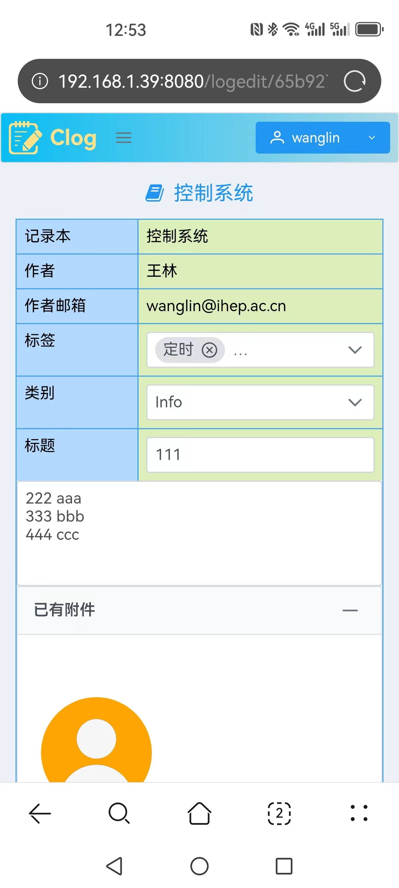

# Mobile web client for Clog

A mobile web client that communicates with the Clog Node.js web service, it provides functions of user login, reading logs, creating logs, updating logs and deleting logs.


The link for Clog is as follows,

https://github.com/wanglin86769/clog2

## Technical solution

* Vue.js: front-end JavaScript framework
* Vuex: state management library
* PrimeVue: Vue.js component library
* axios: HTTP client library
* jsonwebtoken: An implementation of JSON Web Tokens

## Supported Node.js versions

The following Node.js versions have been tested,

* Node.js 18.13.0
* Node.js 17.9.1
* Node.js 16.19.0
* Node.js 15.14.0
* Node.js 14.21.3

## Menu items

* Home: logbook summary
* Logbook grouping: Logbook grouping list
* Logbooks: logbook list
* Tags: tag list
* Users: user info & permission list
* Languages: locale options
* About: software information

|                |                |                |
| -------------- | -------------- | -------------- |
|  |  |  |

## Basic information

List of logbook grouping, logbook, tag and user can be displayed.

|                |                |                |                |
| -------------- | -------------- | -------------- | -------------- |
|  |  |  |  |

## User login

Users can login via local database, LDAP or OAuth2 according to the configuration.

|                |                |                |
| -------------- | -------------- | -------------- |
|  |  |  |

## Read logs

|                |                |                |                |
| -------------- | -------------- | -------------- | -------------- |
|  |  |  |  | 

## Create logs

|                |                |                |                |
| -------------- | -------------- | -------------- | -------------- |
|  |  |  |  | 

## Update logs

|                |                |                |                |
| -------------- | -------------- | -------------- | -------------- |
|  |  |  |  |

## Delete logs

|                |                |                |                |
| -------------- | -------------- | -------------- | -------------- |
|  |  |  |  |

## Development and deployment

### Configuration

Edit the following files if needed,
```
./src/config/configuraion.js
```

### Development

```
npm install
npm run serve
```

### Deployment with Apache

```
npm install
npm run build
cp -r dist/* /var/www/html
```

### Visit web pages

By default, the web pages can be visited on Port 8080,
```
http://localhost:8080/
```

## Get Clog web service up and running

Refer to the following Clog repo,

https://github.com/wanglin86769/clog2

